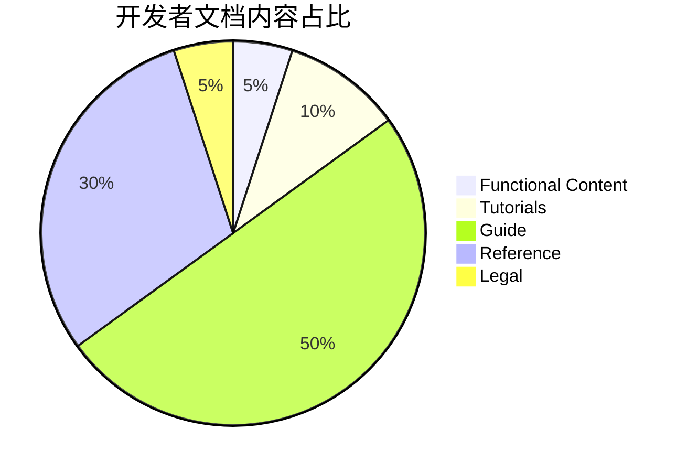
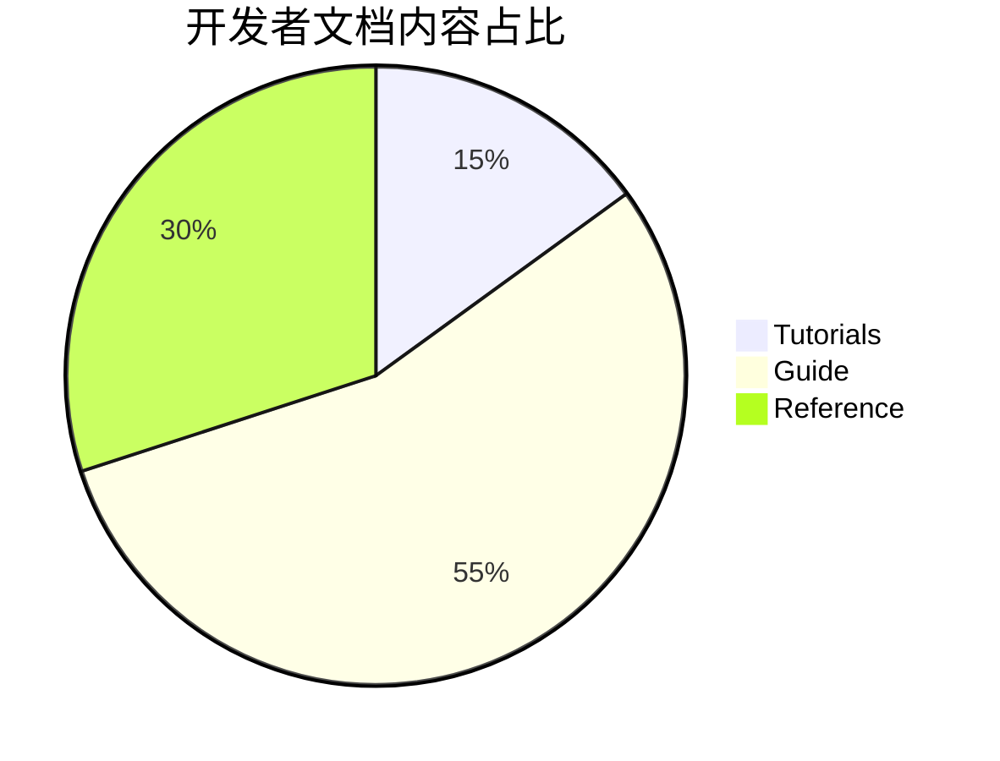

# Craft Content Framework   如何构造一个面向开发者友好的内容框架

by **HuanCheng Bai**

Owner of APILetter.com

<Email v="bestony@linux.com" />

<!-- 走的时候，文档已经有了一套基础的框架。如今离开的时间足够久了，所以也可以把我的经验分享给大家。 -->

---
layout: two-cols-title
columns: is-6
align: l-lt-lt
---

:: title ::

# 白宦成

:: left ::

 - 前飞书开放平台产品经理
 - APIletter.com 作者
 - 工程师

:: right ::

---
layout: two-cols-title
columns: is-6
align: l-lt-lt
---

:: title ::

# 关于我的经历

:: left ::

- 我曾经服务于飞书开放平台，担任 OpenAPI & 开发者体验产品经理
- 在我去的时候，发现了一个很严重的问题：**由于文档内容混乱，导致用户在文档中如无头苍蝇般来回溜达**

:: right ::

和绝大多数开发者文档一样，彼时的飞书开放平台的文档

- 到处是各种 API 文档
- 用户找不到需要的文档

---

---

---
layout: section
---

# 开发者内容的困境

---
layout: default
color: white
---

# 为什么是这样？

1. 产品虽然都有产品经理（PM），但不是==每个产品都有 Technical PM==。
2. 产品虽然关注开发者的反馈，但不是==每个产品都关心文档==。
3. 虽然技术文档需要研发同学的投入，但不是==研发同学就可以 Take Over 所有的文档==。

<v-click>
<AdmonitionType type="important" >
<h1>一个暴论：文档是值得投入一个产品的人力去优化的。如果文档做不好，那你的开发者体验很难做好。</h1>
</AdmonitionType>
</v-click>

---
layout: section
class: text-red
---

# 开发文档真的重要么？

---
layout: quote
color: sky-light
---

<h3>做个思维实验：</h3> 

<h1>如果今天我们没有文档？是否可以服务好开发者？</h1>

 
<v-click>
	可以，但非常贵，我们需要为每一个开发者准备一个支持团队。
</v-click>

---
layout: section
---

# 好的内容应该是什么样的？

---
layout: default
color: white
---

# 好的内容应该是这样的！

- **面向用户设计的**：开发者文档的用户是==开发者==，因此，要用开发者熟悉的语言和方式，交付你的开发者文档。
- **用户路径导向的**：开发者文档的用户是开发者，开发者依然有行为习惯。开发者不同，但也没有那么不同，你依然可以**设计用户的路径，来帮助他更好的 Landing**。
- **以用户场景为基础的**：开发者文档的读者看文档不是为了娱乐，而是**为了完成自己的工作任务**，因此，要尽可能的为你的用户考虑，他们的需求到底是什么，跟着他们的需求去做事。
- **以开发内容为基础，精心编撰过的**：开发者不喜欢写文档，但开发者也不喜欢别人不写文档。那就让**开发者提供基础内容，再由专业人士（Technical Writer）进行写作层面的优化**，确保用户能够更好的阅读。
---
layout: section
---

# Craft Content Framework

---
layout: two-cols-title
columns: is-4
---

:: title ::
# Craft Content Framework

:: left ::

- Functional Content
- Tutorials
- Guide
- Reference
- Legal

:: right ::

---
layout: side-title
side: l
color: violet
titlewidth: is-4
align: rm-lm
---

:: title ::

# `Functional Content`

# <mdi-arrow-right />

:: content ::

- Functional Content 功能性内容服务于非纯粹技术需求的场景
	- 需求调研（判断这个产品是否可以解决我的问题）
	- 产品收费/计费等问题
	- 产品商务/联系方式等问题
- 主要人群：产品经理 / 调研期研发 

<SpeechBubble position="r" color='sky' shape="round" maxWidth="300px">
这个产品可以实现 XXXX 么？
</SpeechBubble>

---
layout: side-title
side: l
color: violet
titlewidth: is-4
align: rm-lm
---

:: title ::

# `Tutorials`

# <mdi-arrow-right />

:: content ::

- Tutorials 教程/新手指南
	- 帮助用户快速 Landing 你的产品；

		- 比如 Quick Start
		- 比如 完成某个独立的功能。

- 主要人群：开始接入 & 评估的研发

<SpeechBubble position="r" color='sky' shape="round" maxWidth="300px">
我怎么样快速验证一下这个功能？
</SpeechBubble>

---
layout: side-title
side: l
color: violet
titlewidth: is-4
align: rm-lm
---

:: title ::

# `Guide`

# <mdi-arrow-right />

:: content ::

- Guide 指南
	- 帮助用户解决你的产品细节问题。
		- 如何调优
		- 如何实现某个细节功能。

- 主要人群：已经完成接入，开始进行业务开发的研发。

<SpeechBubble position="r" color='sky' shape="round" maxWidth="300px">
我怎么在这个功能的基础上实现 YYY ？
</SpeechBubble>

---
layout: side-title
side: l
color: violet
titlewidth: is-4
align: rm-lm
---

:: title ::

# `Reference`

# <mdi-arrow-right />

:: content ::

- Reference 参考文档
	- 帮助用户在使用你的文档时，需要查看一些细节参数

- 主要人群：在接入过程中遇到麻烦/具体调优时的研发。

---
layout: section
---
<IceCream :size="140" mood="sad" color="#FDA7DC" />

<SpeechBubble position="tl" color='pink-light' shape="round" maxWidth="500px">
如果开发者频繁在看你的 Reference，说明你的开发指南写的不够好。
</SpeechBubble>

---
layout: side-title
side: l
color: violet
titlewidth: is-4
align: rm-lm
---

:: title ::

# `Legal`

# <mdi-arrow-right />

:: content ::

- Legal 法律文本
	- 帮助用户摆脱法律的困惑，合法合规的使用你的平台

- 主要人群：产品经理/运营

---
layout: two-cols-title
columns: is-4
---

:: title ::
# Core - Craft Content Framework

:: left ::

- Tutorials
- Guide
- Reference

:: right ::

---
layout: section
---

# 如何开始使用 Craft Content Framework

- Start From Fork
- https://github.com/APILetter/craft-vitepress
- https://github.com/APILetter/craft-docusaurus

---
layout: section
color: sky-light
class: text-center
---

# Q & A
